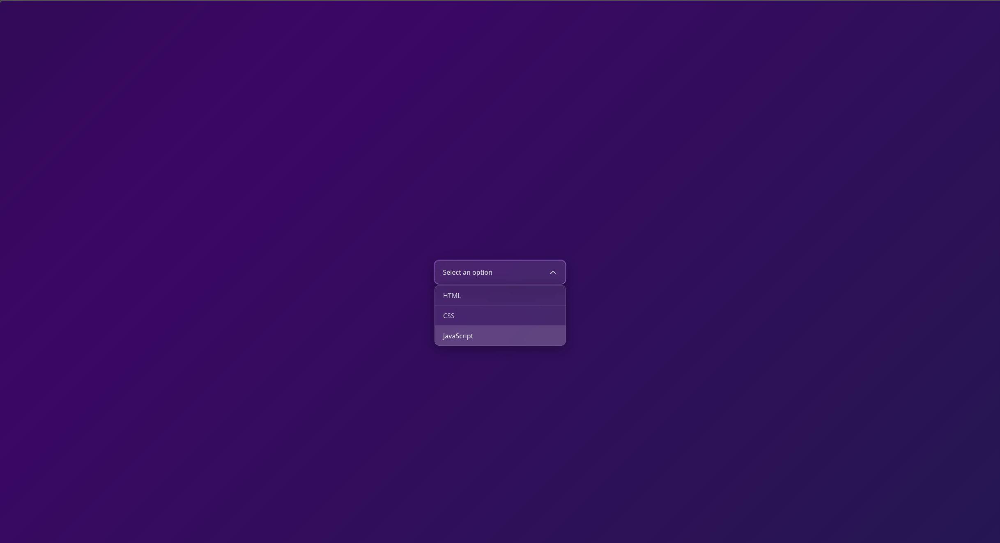

# ⚡ Custom Dropdown

A sleek, responsive, and lightweight custom dropdown component built with **Vanilla JavaScript**, **HTML5**, and **Tailwind CSS**. It provides a clean and interactive dropdown experience with dynamic option selection, selected-state highlighting, and smooth UI interactions.



🔗 Live Demo: https://custom-dropdown-iota.vercel.app/


---

## ✨ Features

* 🎯 **Custom Dropdown**: A fully custom dropdown built without using the native HTML `<select>` element.
* 🔽 **Dropdown Toggle**: Opens and closes the options list when the dropdown button is clicked.
* ✅ **Option Selection**: Allows users to select an option from the dropdown list.
* 🎨 **Selected State**: Highlights the currently selected option.
* 🔄 **Dynamic Value**: Updates the dropdown button with the selected option.
* 📦 **State Management**: Keeps track of the currently selected item using JavaScript.
* 📱 **Responsive Design**: Optimized for desktop, tablet, and mobile screens.
* ⚡ **Vanilla JavaScript**: Built without React or other JavaScript frameworks.

---

## 🛠️ Tech Stack

* **HTML5**: Semantic document structure and dropdown markup.
* **Tailwind CSS**: Utility-first CSS framework for responsive styling and UI design.
* **Vanilla JavaScript (ES6+)**: DOM manipulation, event handling, dropdown state management, and option selection.

---

## ⚙️ Functionality

The dropdown is built from scratch using HTML elements and JavaScript instead of the native HTML `<select>` element.

When the user clicks the dropdown button, the options list is displayed or hidden. Selecting an option updates the button text, stores the selected value, highlights the selected option, and closes the dropdown.

The project uses JavaScript event handling and DOM manipulation to control the entire dropdown behavior.

---

## 📁 Project Structure

```text
Custom-Dropdown/
├── assets/
│   ├── js/
│   │   └── app.js          # Dropdown logic & event handling
│   │
│   └── style/
│       ├── input.css       # Tailwind CSS source file
│       └── output.css      # Compiled CSS stylesheet
│
├── index.html              # Main HTML document
├── package.json            # Project dependencies & scripts
├── package-lock.json       # Dependency lock file
└── README.md               # Project documentation
```

---

## 🚀 How It Works

1. Click the dropdown button to open the options list.
2. Select an option from the available items.
3. The selected option is displayed inside the dropdown button.
4. The selected option receives a highlighted state.
5. The previously selected option loses its highlighted state.
6. The dropdown automatically closes after selection.
7. The selected value is stored in the application state.

---

## 🧠 What I Practiced

* DOM selection and manipulation
* Event handling
* Event delegation
* `classList` manipulation
* `querySelector` and `querySelectorAll`
* Managing UI state with JavaScript
* Dynamic content updates
* Building interactive components with Vanilla JavaScript

---

## 📄 License

This project is licensed under the **MIT License**.
